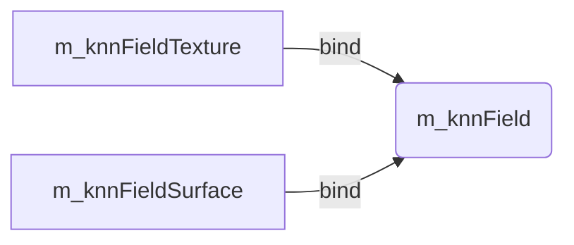

# 一、变量说明
## 1.1 **MapArr** 

```cpp
typedef DeviceArray2D<float4> MapArr;
```
他是一个 float4 型的gpu二维数组

m_vmap_cano, m_nmap_cano, m_vmap_warp, m_nmap_warp 都是 **MapArr** 类型的。

vmap中存储了点信息，nmap里面存储了法向量信息。

```cpp
//-- kinect_util.cu --
__global__ void computeVmapKernel(const PtrStepSz<depthtype> depth, PtrStep<float4> vmap, Intr intr)
{
    ...
            float3 xyz = intr.uvd2xyz((float)u, (float)v, z);
            vmap(v, u) = make_float4(xyz.x, xyz.y, xyz.z, 1.f);    //vmap 的前三位为坐标，最后一位为1
    ...
}

......

__global__ void computeNmapKernel(int rows, int cols, const PtrStep<float4> vmap, PtrStep<float4> nmap)
{
    ...
    if (!isnan(v00.x) && !isnan(v01.x) && !isnan(v10.x))
    {
        float3 r = normalized(cross(v01 - v00, v10 - v00));
        nmap(v, u) = make_float4(r.x, r.y, r.z, 0);    //nmap 的前三位为坐标，最后一位为0           
    }
    else
        nmap(v,u).x = numeric_limits<float>::quiet_NaN();
}
```


## 1.2 Knn-Field
<font face="consolas" color="#0033ff">m_knnField</font> 是一个 cuda 3D Array 

<font face="consolas" color="#0033ff">m_knnFieldSurface</font> 与  <font face="consolas" color="#0033ff">m_knnFieldTexture</font> 都绑定在 <font face="consolas" color="#0033ff">m_knnField</font> 上





# 二、实现
# 2.1 流程流程
核心流程代码
```cpp
void DynamicFusionProcessor::processFrame(const DepthMap& depth, const ColorMap& color)
{
	depth.copyTo(m_depth_input);
	color.copyTo(m_color_input);
	//eroseColor(color, m_color_input, 1);
	Tbx::Transfo rigid = rigid_align();  // ICP
	m_warpField->set_rigidTransform(rigid);
	estimateWarpField();   // warp 
	nonRigidTsdfFusion();  // psdf
	surfaceExtractionMC();
	insertNewDeformNodes();  //空的,  done in insertNewDeformNodes()
	updateRegularizationGraph();
	updateKNNField();
	m_frame_id++;
}
```


